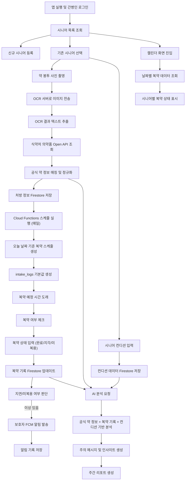

## Frontend Work-Flowchart

## 전체 워크플로우 설명

본 프로젝트는 간병인이 여러 명의 시니어를 효율적으로 관리할 수 있도록
복약 과정을 하나의 흐름으로 정리한 복약 관리 시스템이다.
전체 기능은 실제 사용 흐름을 기준으로 설계되었으며,
크게 시니어 관리, 처방 생성, 복약 기록, 알림 처리, 분석 단계로 나뉜다.

---

### 1. 앱 실행 및 시니어 관리
간병인은 앱에 로그인한 후,
자신이 관리 중인 시니어 목록을 확인한다.
기존 시니어를 선택하거나 새로운 시니어를 등록할 수 있으며,
이 단계에서 시니어의 기본 정보와 보호자 정보가 함께 관리된다.

---

### 2. 약 봉투 촬영 및 처방 정보 생성
시니어를 선택한 후 약 봉투를 촬영하면,
이미지는 백엔드 OCR 서버로 전송된다.
OCR 서버에서는 약 이름을 중심으로 텍스트를 추출하고,
추출된 약 이름을 기준으로 식약처 의약품 Open API를 조회한다.

이를 통해 효능, 용법, 주의사항 등 공식 약 정보를 함께 가져오며,
병원·약국·공식 데이터 간 이름 차이를 줄이기 위해
약 이름 정규화 및 매칭 과정을 거친다.
최종적으로 정리된 처방 정보는 Firestore에 저장된다.

---

### 3. 복약 스케줄 자동 생성
처방 정보가 저장되면,
Cloud Functions를 통해 매일 복약 스케줄 생성 로직이 실행된다.
해당 날짜에 복용해야 할 약 정보를 기준으로
아침, 점심, 저녁 복약 스케줄이 생성되며,
각 시간대에 대한 기본 복약 기록(intake_logs)이 함께 생성된다.

이 과정을 통해 사용자는 별도의 설정 없이
하루 단위로 복약 관리를 할 수 있다.

---

### 4. 복약 기록 입력
복약 시간이 되면,
간병인은 앱에서 해당 시간대의 복약 상태를
완료, 지각, 미복용 중 하나로 선택한다.
선택된 상태는 즉시 Firestore에 반영되어
해당 날짜의 복약 기록으로 저장된다.

---

### 5. 보호자 알림 처리
복약 기록이 업데이트되면,
시스템에서는 지연 또는 미복용 여부를 판단한다.
설정된 기준을 초과한 경우,
Firebase Cloud Messaging을 통해 보호자에게 알림을 전송하며,
알림 이력은 별도로 저장된다.

---

### 6. 캘린더 기반 복약 현황 확인
간병인은 캘린더 화면을 통해
날짜별 복약 상태를 확인할 수 있다.
각 날짜에는 시니어별 복약 상태가 색상으로 표시되어,
전체 복약 현황을 한눈에 파악할 수 있도록 구성되어 있다.

---

### 7. 컨디션 기록
복약 관리와 함께,
간병인은 시니어의 컨디션 상태를 주기적으로 입력한다.
컨디션 데이터는 날짜 단위로 저장되며,
이후 분석 단계에서 복약 기록과 함께 활용된다.

---

### 8. 분석 및 리포트 제공
복약 기록, 컨디션 데이터, 공식 약 정보를 기반으로
AI 분석이 수행된다.
분석 결과는 주의 메시지나 간단한 인사이트 형태로 제공되며,
주간 단위로 요약된 리포트를 통해
<<<<<<< HEAD
시니어의 복약 및 건강 상태를 종합적으로 확인할 수 있다.
=======
시니어의 복약 및 건강 상태를 종합적으로 확인할 수 있다.
>>>>>>> 9ba4932ad83b0d093dec57b2798c73e8e158f533
